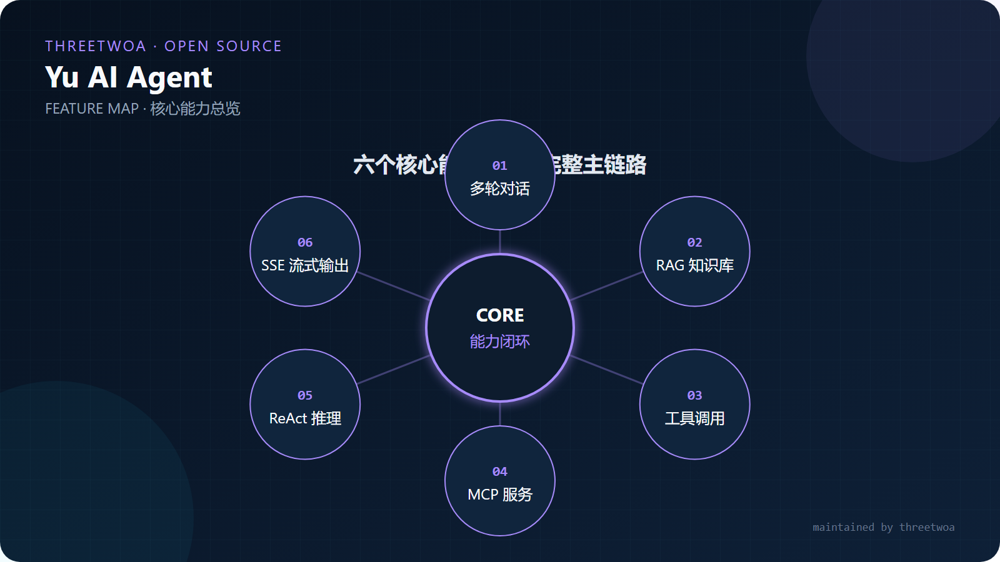
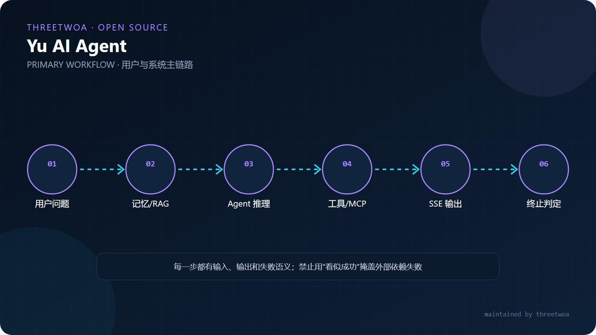
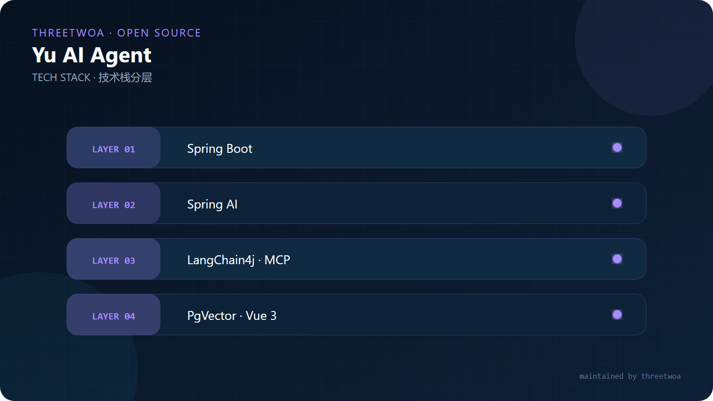
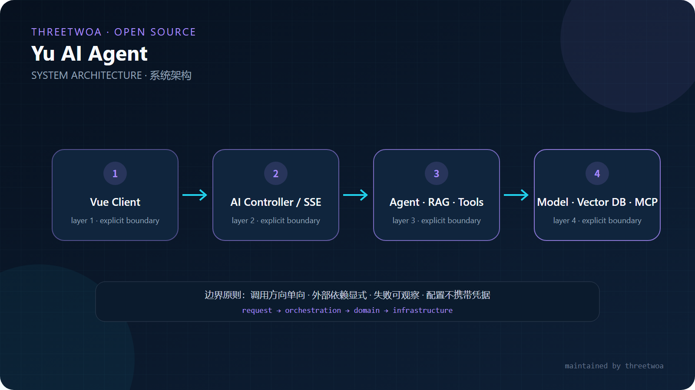
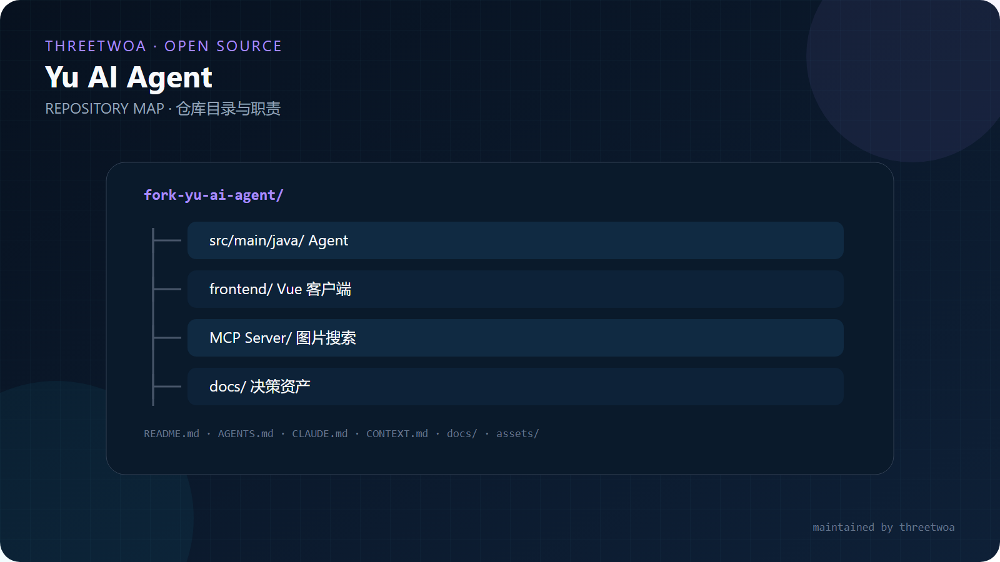

<p align="center">
  <h1 align="center">Yu AI Agent</h1>
  <p align="center"><em>从知识检索、工具调用到自主规划的 Java 智能体工程</em></p>
  <p align="center">一套可拆解、可运行的 Agent 实践：统一覆盖对话记忆、RAG、Tool Calling、MCP 与自主规划，并提供 Vue 交互端和独立图片搜索 MCP 服务。</p>
</p>

<p align="center"></p>

<p align="center">
  
  
  
  
</p>

<p align="center"><a href="#产品边界">产品边界</a> · <a href="#功能矩阵">功能矩阵</a> · <a href="#快速开始">快速开始</a> · <a href="#架构">架构</a> · <a href="#模块阅读顺序">模块阅读顺序</a></p>

> 基于 [liyupi/yu-ai-agent](https://github.com/liyupi/yu-ai-agent) 进行二次开发。上游版权和许可证声明继续有效；本分支的源码身份、包坐标与维护信息由 `threetwoa` 维护。

## 产品边界

| 组件 | 职责 | 不负责 |
|---|---|---|
| Agent 服务 | 编排模型、记忆、工具与规划循环 | 替代业务侧权限校验 |
| RAG | 文档加载、切分、检索与上下文增强 | 保证模型输出事实正确 |
| MCP | 以标准协议暴露图片搜索能力 | 保存业务会话状态 |
| Vue 前端 | 提供对话与任务交互入口 | 持有服务端密钥 |

## 功能矩阵

<p align="center"></p>

| 能力 | 关键实现 | 说明 |
|---|---|---|
| 对话 Agent | `src/main/java/com/threetwoa/yuaiagent/agent/` | 统一封装模型调用与执行状态 |
| RAG | `rag/`、`advisor/` | 文档检索、查询改写与上下文注入 |
| 工具调用 | `tools/` | 文件、网页、搜索等受控工具 |
| 自主规划 | `agent/YuManus.java` | 在最大步数和异常边界内循环执行 |
| MCP 图片搜索 | `yu-image-search-mcp-server/` | 独立 Spring Boot MCP Server |
| Web 交互 | `yu-ai-agent-frontend/` | Vue 3 + Vite 客户端 |

## 主链路

<p align="center"></p>

## 快速开始

要求：JDK 21、Node.js 18+，以及按 `application.yml` 配置的模型与数据库连接。密钥只放在本地环境或未跟踪配置中。

```bash
git clone https://github.com/Aafff623/fork-yu-ai-agent.git
cd fork-yu-ai-agent
./mvnw spring-boot:run
```

```bash
cd yu-ai-agent-frontend
npm install
npm run dev
```

## 技术栈

<p align="center"></p>

## 架构

<p align="center"></p>

```text
Vue Client → Spring Boot API → Agent Runtime → Chat Model
                                  ├─ Memory
                                  ├─ RAG / Vector Store
                                  ├─ Local Tools
                                  └─ MCP Client → Image Search MCP Server
```

核心边界：工具执行失败会回到 Agent 状态机处理；自主规划必须受最大步数限制；模型输出不应绕过应用权限和输入校验。

## 模块阅读顺序

<p align="center"></p>

| 顺序 | 路径 | 阅读目的 |
|---|---|---|
| 1 | `src/main/java/com/threetwoa/yuaiagent/agent/` | 理解 Agent 生命周期与规划循环 |
| 2 | `src/main/java/com/threetwoa/yuaiagent/app/` | 理解业务 Agent 如何装配记忆和顾问链 |
| 3 | `src/main/java/com/threetwoa/yuaiagent/rag/` | 理解知识入库与检索链路 |
| 4 | `src/main/java/com/threetwoa/yuaiagent/tools/` | 检查工具输入、输出和副作用边界 |
| 5 | `yu-image-search-mcp-server/` | 理解 MCP 服务注册与调用 |
| 6 | `yu-ai-agent-frontend/src/` | 理解交互入口与流式响应展示 |

## 开发与验证

```bash
./mvnw test
cd yu-ai-agent-frontend && npm run build
```

上游同步前先审查包名、品牌文案和配置差异，避免覆盖 `com.threetwoa` 迁移。

## 视觉画册

点击缩略图可查看原始矢量图：

| | |
|:---:|:---:|
| [](assets/images/readme/features.svg)<br>**Features** · 核心能力 | [](assets/images/readme/architecture.svg)<br>**Architecture** · 系统边界 |
| [](assets/images/readme/tech-stack.svg)<br>**Tech Stack** · 技术分层 | [](assets/images/readme/workflow.svg)<br>**Workflow** · 主链路 |
| [](assets/images/readme/structure.svg)<br>**Structure** · 仓库地图 | |

## 维护者与许可

原作者：**李鱼皮（[liyupi](https://github.com/liyupi)）**。二次开发维护者：**threetwoa**。许可证以 [LICENSE](LICENSE) 及[上游仓库](https://github.com/liyupi/yu-ai-agent)声明为准。
